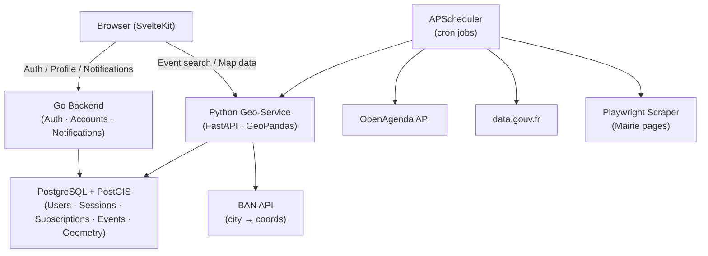
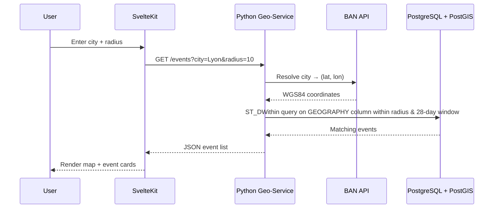
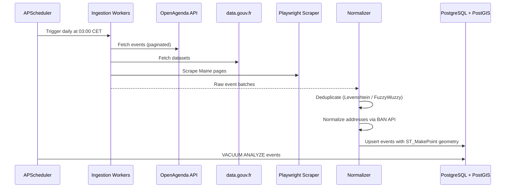

## Overview

**L'Événement Local** is a hyper-local French event discovery platform. Users search for cultural, municipal, and social events within a configurable radius (1–50 km) over a 28-day window. The system aggregates data from official French open-data sources, scrapes Mairie agendas, and normalises everything into a unified spatial database.

## System Architecture



## Services

### 1. Go Backend (`back/`) — Account & Notification Service

Remains the authority for:

- User authentication (Better Auth / JWKs)
- Session management
- Subscription & payments (Polar)
- **New:** User saved location (lat/lon + radius preference)
- **New:** Notification preferences & push delivery

### 2. Python Geo-Service (`geo/`) — New Service

Owns all map and event data:

- **FastAPI** HTTP API consumed by the frontend
- **GeoPandas + Shapely** for in-memory spatial transformations and data cleaning
- **PostgreSQL + PostGIS** as the shared spatial store (same instance as Go backend)
- **asyncpg** for async database access from Python
- **APScheduler** for scheduled ingestion jobs
- **Playwright** for Mairie scraping

### 3. SvelteKit Frontend (`front/`) — Extended

- New map view (Leaflet.js or Mapbox GL)
- Radius slider + city/ZIP search
- Event cards with source badges
- Notification opt-in settings page

## Data Flow: Event Search



## Data Flow: Ingestion Pipeline



## Database Schema

All data lives in a **single PostgreSQL + PostGIS** instance. The Go backend and Python geo-service connect to the same database with separate roles.

### Existing tables (Go backend — unchanged)

`user`, `session`, `account`, `verification`, `jwks`, `subscription`, `payment_event` — no changes.

### New columns on `user` (Go backend migration)


| Column              | Type                     | Notes                                                |
| ------------------- | ------------------------ | ---------------------------------------------------- |
| `saved_location`    | `GEOGRAPHY(Point, 4326)` | Stored as PostGIS geography for direct spatial joins |
| `saved_radius_km`   | `INTEGER DEFAULT 5`      | User's preferred search radius                       |
| `notify_enabled`    | `BOOLEAN DEFAULT FALSE`  | Opt-in for push notifications                        |
| `notify_push_token` | `TEXT`                   | Future push delivery token                           |


### New `events` table (Python geo-service migration)


| Field           | Type                        | Notes                                         |
| --------------- | --------------------------- | --------------------------------------------- |
| `event_id`      | `UUID`                      | Primary Key, `gen_random_uuid()`              |
| `title`         | `TEXT`                      | Sanitized                                     |
| `description`   | `TEXT`                      | Full details                                  |
| `start_dt`      | `TIMESTAMPTZ`               | UTC                                           |
| `end_dt`        | `TIMESTAMPTZ`               | UTC, nullable                                 |
| `location_name` | `TEXT`                      | Venue name                                    |
| `address`       | `TEXT`                      | Normalized (BAN)                              |
| `geom`          | `GEOGRAPHY(Point, 4326)`    | PostGIS geography column                      |
| `source_tag`    | `TEXT`                      | `openagenda` · `datagouv` · `mairie_*` · `fb` |
| `source_url`    | `TEXT`                      | Original URL                                  |
| `created_at`    | `TIMESTAMPTZ DEFAULT now()` | Ingestion timestamp                           |


**Spatial index:** GiST index on `geom` — `CREATE INDEX idx_events_geom ON events USING GIST(geom)` — enables O(log N) `ST_DWithin` queries.

### New `source_hashes` table (deduplication)


| Field          | Type   | Notes                                      |
| -------------- | ------ | ------------------------------------------ |
| `source_tag`   | `TEXT` | &nbsp;                                     |
| `content_hash` | `TEXT` | SHA-256 of `(title, start_dt, source_tag)` |
| `event_id`     | `UUID` | FK → `events.event_id`                     |


## Distance Query Logic

PostGIS `GEOGRAPHY` type handles metric distance natively on the WGS84 ellipsoid — no manual projection to EPSG:2154 required:

```sql
ST_DWithin(events.geom, ST_MakePoint(lon, lat)::geography, radius_meters)
AND start_dt BETWEEN now() AND now() + INTERVAL '28 days'
```

`ST_DWithin` on a `GEOGRAPHY` column uses the GiST index automatically, giving O(log N) performance. For cases requiring Lambert-93 precision (e.g., exact boundary calculations), `ST_Distance(ST_Transform(..., 2154), ST_Transform(..., 2154))` remains available.

## Compliance & Constraints


| Constraint         | Implementation                                                                                                                                           |
| ------------------ | -------------------------------------------------------------------------------------------------------------------------------------------------------- |
| RGPD               | Event data is strictly public domain; user PII stays in the `user` table, never in `events`                                                              |
| Rate limiting      | Scrapers use `random_sleep` (2–8s) between requests                                                                                                      |
| Memory cap         | GeoPandas in-memory processing capped at 2 GB RAM                                                                                                        |
| DB roles           | Go backend uses the existing `POSTGRES_USER`; Python geo-service uses a dedicated read-write role scoped to the `events` and `source_hashes` tables only |
| Inter-service auth | Go backend issues a short-lived JWT; Python service validates it for notification endpoints                                                              |


## Roadmap Phases


| Phase                  | Scope                                                                        | Tickets    |
| ---------------------- | ---------------------------------------------------------------------------- | ---------- |
| **P0 — Foundation**    | Python geo-service scaffold, PostGIS schema & migrations, Docker integration | T-01, T-02 |
| **P1 — Ingestion**     | OpenAgenda + data.gouv.fr harvesters, deduplication, BAN normalization       | T-03, T-04 |
| **P2 — Search API**    | FastAPI radius search endpoint, BAN city resolution                          | T-05       |
| **P3 — Go Extensions** | User location saving, notification preferences migration                     | T-06       |
| **P4 — Frontend**      | Map view, radius slider, event cards, notification settings                  | T-07, T-08 |
| **P5 — Scraping**      | Playwright Mairie scraper, scheduler hardening                               | T-09       |


&nbsp;